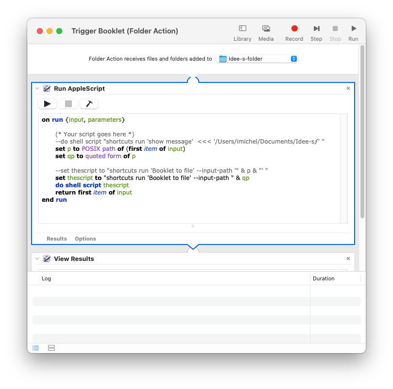
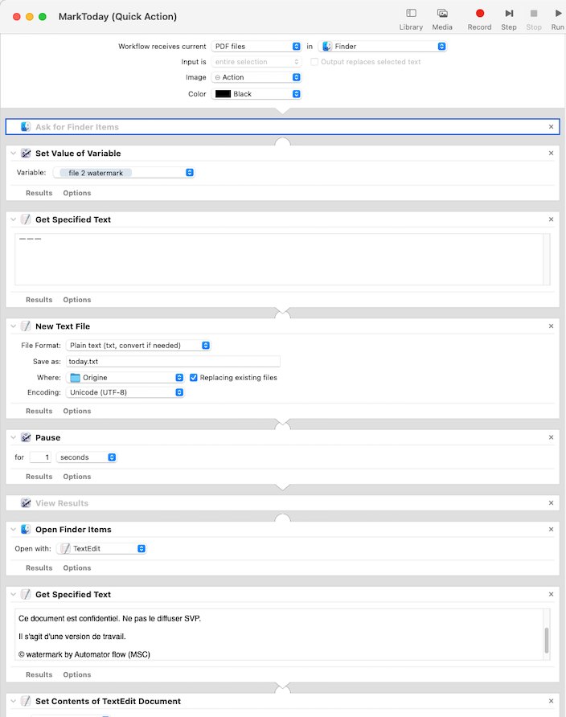
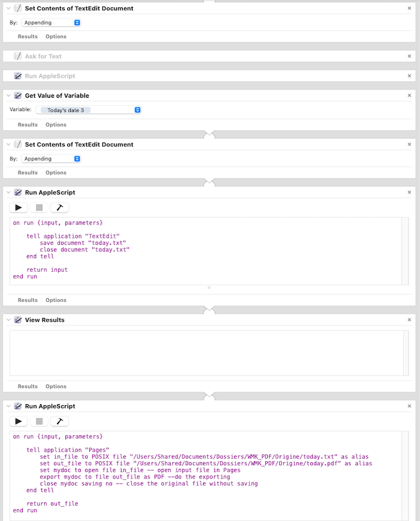
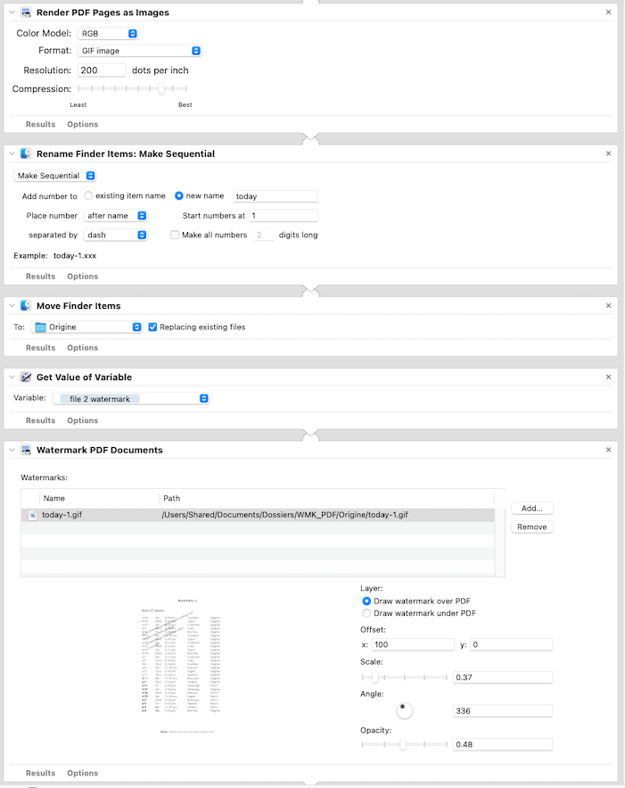
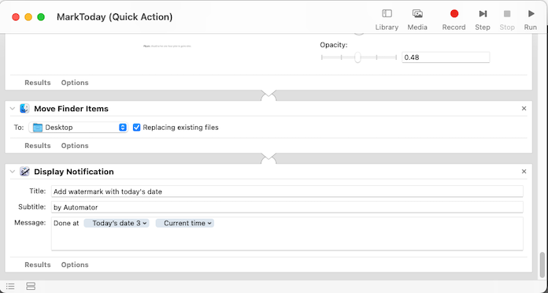
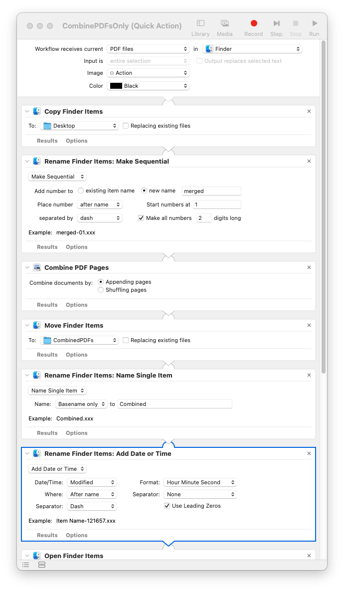
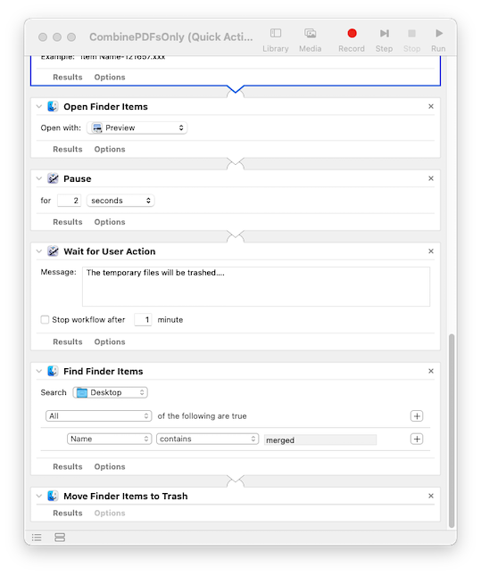

# Automator examples in Ventura MacOs 13
 Automator Flow and Action made in Ventura MacOs 13. The screenshots will help you to create “quick action” with Automator. The actions are visible in quick Actions mouse sub-menu on selected file(s).

Soon : some scripts and workflows with latest Ventura
- A folder action script to create a booklet with Application “**I love Booklet**” (available in Appstore). Combines Automator, AppleScript and Shortcuts !
- Add watermark, simple and dynamic (from text)
- Combine PDFs
- Copy from aliases in folder to another…

## Combines Automator, AppleScript and Shortcuts
Three screenshots to show possible relationships :
- 
In Automator Folder Action Script : Applescript is triggered by a new file in this folder (an alias is added inside printer “Save as pdf”) and the automator is linked to this folder. **Note that the Shortcut App. is launched by do shell script and not shortcuts run** (*which is not reliable*)
- 
The first part receives the pdf from the Automator (his names is saved in a variable used after to name the booklet). The booklet app is used in two ways - with and without marking empty pages. Note that here some output values of action are saved in variable to be used after “Choose Menu parts”.
- 
The second part renames the booklet pdf and you have choice to print this or to open it with preview. For booklet, it is good to save a print preset with doubled sided on ‘short edge’ and layout with 2 pages par sheet !

What we learn creation this folder actions script :
- **stable** call from AppleScript to Shortcuts App. Via do shell script (and way to pass the file path)
- how to insert in choosing menu parts of shortcuts actions
- how to combine variables in renaming file action
(The AppleScript is inside “AppleScript” folder)

## Add watermark on pdf
Note : le script avec Pages est dans le dossier “AppleScript”

- 
- Récupération du document pdf (mis en variable)
- Création du texte qui servira de watermark, (via textedit)

- 
- Transformation du texte en pdf (via Pages) puis image (gif)
- 
- mise en place par superposition du watermark
- 
- le pdf traité est déposé sur le bureau…

## Combine selected pdf files

- 
- Récupération des documents pdf
- Renommage des fichiers sans caractères non ascii (©, é,â… - en effet sinon le module Combines PDF Pages ne fera pas l’assemblage
- déplace le fichier pdf résultant dans le dossier “CombinedPDFs” (à ajuster selon votre configuration)
Et le renomme en deux temps…

- 
- Affiche le résultat dans Preview. (La pause pour laisser le temps..)
- Après votre accord, mise à la poubelle des fichiers temporaires issus du renommage.

